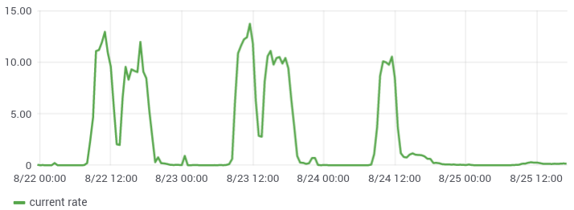

<!-- _class: title -->

<!--

labels match grafana: don't be creative
links in AM


relabel per env

timezone
-->
<!-- footer: @roidelapluie -->

<div class="front">
  <div class="author">Julien Pivotto<br/>@roidelapluie</div>
  <div class="title">Improved alerting with Prometheus and Alertmanager</div>
  <div class="location"><span>PromCon Munich</span>November 8th, 2019</div>
</div>

---


# Important notes!

- This talk contains PromQL.
- This talk contains YAML.
- What you will see was built over time.

---

<!-- _class: blue -->

## Context

---

# Message Broker

Message Broker in the Belgian healthcare sector
- High visibility
- Sync & Async
- Legacy & New
- Lots of partners
- Multiple customers

---

# Monitoring


Technical


Business
  

<div class="license">
<a href="https://fontawesome.com/license/free">Font Awesome CC-BY-4.0</a>
</div>

---

# Alerting

Alerts are not only for incidents.

Some alerts carry business information about ongoing events (good or bad).

Some alerts go outside of our org.

Some alerts are not for humans.

---

# Channels

<div class="license">
<a href="https://fontawesome.com/license/free">Font Awesome CC-BY-4.0</a>
</div>


---

# Time frames

Repeat every 15m, 1h, 4h, 24h, 2d
24x7, 10x5, 12x6, 10x7, never

Legal holidays

---

# 15m/1h repeat interval?

Updated annotations & value

Updated graphs

---

# Constraints

- Alertmanager owns the notifications
- Webhook receivers have no logic
- Take decisions at time of alert writing

---

# Challenges

- Avoid Alertmanager reconfigurations
- Safe and easy way to write alerts
- Only send relevant alerts
- Alert on staging environments

---

<!-- _class: blue -->

## PromQL

---

# Gauges

```
- alert: a target is down
  expr: up == 0
  for: 5m
```

---

# Gauges


---

# Gauges

<p class="instead">Instead of:</p>

```
- alert: a target is down
  expr: up == 0
  for: 5m
```

<p class="instead">Do:</p>


```
- alert: a target is down
  expr: avg_over_time(up[5m]) < .9
  for: 5m
```

---

# Hysteresis

Alert me if temperature is above 27°C

---

# Hysteresis


```
- alert: temperature is above threshold
  expr: temperature_celcius > 27
  for: 5m
  labels:
    priority: high
```

---

# Hysteresis


---

# Hysteresis

**Hysteresis** is the dependence of the state of a system on its history.

<div class="license">
<a href="https://en.wikipedia.org/wiki/Hysteresis">Wikipedia CC-BY-SA-3.0</a>
</div>

---

# Hysteresis

```
- alert: temperature is above threshold
  expr: |
    avg_over_time(temperature_celcius[5m])
    > 27
  for: 5m
  labels:
    priority: high
```

*alternative: `max_over_time`*
5m might be too short
if > 5m: when is it resolved?

---

# Hysteresis

Alert me
- if temperature is above 27°C
- only stop when it gets below 25°C

---

# Hysteresis

```
(avg_over_time(temperature_celcius[5m]) > 27)
or (temperature_celcius > 25 and
count without (alertstate, alertname, priority)
  ALERTS{
  alertstate="firing",
  alertname="temperature is above threshold"
})
```

---

# Computed threshold

```
temperature_celcius > 27
```

but...


---

# Computed threshold

```
- record: temperature_threshold_celcius
  expr: |
    27+0*temperature_celcius{
      location=~".*ambiant"
    }
    or 25+0*temperature_celcius
```

Bonus: `temperature_threshold_celcius` can be used in grafana!

---

# Computed threshold

```
- alert: temperature is above threshold
  expr: |
    temperature_celcius >
    temperature_threshold_celcius
```

Note: put threshold & alert
in the same alert group

---

# Absence

```
- alert: no more sms
  expr: sms_available < 39000
```

---

# Absence


---

# Absence


No metric = No alert!
Metric is back = New alert!

---

# Absence

```
- record: sms_available_last
  expr: |
    sms_available or
    sms_available_last
- alert: no more sms
  record: sms_available_last < 39000
- alert: no more sms data
  record: absent(sms_available)
  for: 1h
```

---

<!-- _class: blue -->

## Configuration

---

# Recipients

recipients:

<strong>name/channel</strong>

jpivotto/mail
opsteam/ticket
appteam/message
customer/sms
dc1/jenkins

---

# Receivers

<div class="prelegend">Alertmanager receivers</div>

```
- name: "opsteam/mail"
  email_configs:
  - to: 'ops@inuits.eu'
    send_resolved: yes
    html: "{{ template \"inuits.html.tmpl\" . }}"
    text: "{{ template \"inuits.txt.tmpl\" . }}"
    headers:
        Subject: "{{ template \"title.tmpl\" . }}"
```

Hint: Subject can be a template.

---

# Receivers

<div class="prelegend">Alertmanager receivers</div>

```
- name: "opsteam/mail/noresolved"
  email_configs:
  - to: 'ops@inuits.eu'
    send_resolved: no
    html: "{{ template \"inuits.html.tmpl\" . }}"
    text: "{{ template \"inuits.txt.tmpl\" . }}"
    headers:
        Subject: "{{ template \"title.tmpl\" . }}"
```

Same, but with `send_resolved: no`

---


# Email: CC, BCC

<div class="prelegend">Alertmanager receivers</div>

```
- name: "lotsOfPeople/mail"
  email_configs:
  - to: 'a@inuits.eu,b@inuits.eu,c@inuits.eu'
    headers:
        To: a@inuits.eu
        CC: b@inuits.eu
        Reply-To: support@inuits.eu
```

`c@inuits.eu` is now BCC.

---

# Who gets the alert?

<div class="prelegend">Prometheus alert</div>

```
- alert: Not  enough traffic
  expr: ...
  for: 5m
  labels:
    recipients: customer1/sms,opsteam/ticket
  annotations:
    summary: ...
    resolved_summary: ...
```

---

# Who gets the alert?

<div class="prelegend">Alertmanager routing</div>

```
- receiver: "customer1/sms"
  match_re:
    recipient: "(.*,)?customer1/sms(,.*)?"
  continue: true
  routes: [...]
- receiver: "opsteam/ticket"
  match_re:
    recipient: "(.*,)?opsteam/ticket(,.*)?"
  continue: true
  routes: [...]
```

---

# Resolved

<div class="prelegend">Prometheus alert</div>

```
- alert: Not  enough traffic
  expr: ...
  for: 5m
  labels:
    recipients: customer1/sms,opsteam/ticket
    send_resolved: "no"
```

---

# Resolved

<div class="prelegend">Alertmanager routing</div>

```
- receiver: "customer1/sms"
  match_re:
    recipient: "(.*,)?customer1/sms(,.*)?"
  continue: true
  routes:
  - receiver: customer1/sms/noresolved
    match:
      send_resolved: "no"
```

---

# Repeat interval

<div class="prelegend">Prometheus alert</div>

```
- alert: Not  enough traffic
  expr: ...
  for: 5m
  labels:
    recipients: customer1/sms,opsteam/ticket
    repeat_interval: 1h
```

---

# Repeat interval

<div class="prelegend">Alertmanager routing</div>

```
- receiver: "customer1/sms"
  match_re:
    recipient: "(.*,)?customer1/sms(,.*)?"
  continue: true
  routes:
  - receiver: customer1/sms
    repeat_interval: 1h
    match:
      repeat_interval: 1h
```

---

# Extra configurations

Some channels have specific `group_interval: 0s`.
Some channels always `send_resolved: no`.
Some recipients have aliases (ticket+chat).

---

# Routes tree

<div class="prelegend">Extract of amtool config routes show</div>

<pre style="font-size: .5em">
─ {recipient=~"^(?:(.*,)?jpivotto/mail(,.*)?)$"}  continue: true receiver: jpivotto/mail
   ├── {repeat_interval="15m",send_resolved="no"}  receiver: jpivotto/mail/noresolved
   ├── {repeat_interval="15m"}  receiver: jpivotto/mail
   ├── {repeat_interval="30m",send_resolved="no"}  receiver: jpivotto/mail/noresolved
   ├── {repeat_interval="30m"}  receiver: jpivotto/mail
   ├── {repeat_interval="1h",send_resolved="no"}  receiver: jpivotto/mail/noresolved
   ├── {repeat_interval="1h"}  receiver: jpivotto/mail
   ├── {repeat_interval="2h",send_resolved="no"}  receiver: jpivotto/mail/noresolved
   ├── {repeat_interval="2h"}  receiver: jpivotto/mail
   ├── {repeat_interval="4h",send_resolved="no"}  receiver: jpivotto/mail/noresolved
   ├── {repeat_interval="4h"}  receiver: jpivotto/mail
   ├── {repeat_interval="6h",send_resolved="no"}  receiver: jpivotto/mail/noresolved
   ├── {repeat_interval="6h"}  receiver: jpivotto/mail
   ├── {repeat_interval="12h",send_resolved="no"}  receiver: jpivotto/mail/noresolved
   ├── {repeat_interval="12h"}  receiver: jpivotto/mail
   ├── {repeat_interval="24h",send_resolved="no"}  receiver:jpivotto/mail/noresolved
   ├── {repeat_interval="24h"}  receiver: jpivotto/mail
   ├── {send_resolved="no"}  receiver: jpivotto/mail/noresolved
   └── {repeat_interval=""}  receiver: jpivotto/mail
</pre>

---

# How do we achieve it?

Config Management!

<div class="prelegend">Our input</div>

```
receivers:
  customer:
    email:
      to: [customer@example.com]
      cc: [service-management@inuits.eu]
      bcc: [ops@inuits.eu]
    sms: [+1234567890, +2345678901]
    chat:
      room: "#customer"
```

---

# Configuration management

- Script that is deployed with AM
- Knows all the recipients
- Will validate alerts yaml
    - promtool
    - mandatory labels
    - validate `receivers` label
    - validate `repeat_interval` label

Not possible to write alerts that go nowhere by accident.

---

<!-- _class: blue -->

## Time frame

---

# Time frame

<div class="prelegend">Prometheus alert</div>

```
- alert: a target is down
  expr: up == 0
  for: 5m
  labels:
    recipients: customer1/sms,opsteam/ticket
    time_window: 13x5
```

---

# Timezone

<pre style="font-size: .6em">
- record: daily_saving_time_belgium
  expr: |
    (vector(0) and (month() < 3 or month() > 10))
    or
    (vector(1) and (month() > 3 and month() < 10))
    or
    (
     (
      (month() %2 and (day_of_month() - day_of_week()
      > (30 + +month() % 2 - 7)) and day_of_week() > 0)
     or
      -1*month()%2+1 and (day_of_month() -
      day_of_week() <= (30 + month() % 2 - 7))
     )
    )
    or
    (vector(1) and ((month()==10 and hour() < 1) or (month()==3 and hour() > 0)))
    or
    vector(0)
- record: belgium_localtime
  expr: |
     time() + 3600 + 3600 * daily_saving_time_belgium
</pre>

---

# Belgian hour

```
hour(belgium_localtime)
```

`hour()` and other time-functions can take a timestamp as argument.


---

# Holidays

```
- record: public_holiday
  expr: |
     vector(1) and
     day_of_month(belgium_localtime) == 25
     and month(belgium_localtime) == 12
  labels:
     name: Xmas
```

---

# Easter

<div class="license">
<a href="https://en.wikipedia.org/wiki/Computus">Wikipedia CC-BY-SA-3.0</a>
</div>


<pre style="font-size: .4em">
groups:
- name: Easter Meeus/Jones/Butcher Algorithm
  interval: 60s
  rules:
    - record: easter_y
      expr: year(belgium_localtime)
    - record: easter_a
      expr: easter_y % 19
    - record: easter_b
      expr: floor(easter_y / 100)
    - record: easter_c
      expr: easter_y % 100
    - record: easter_d
      expr: floor(easter_b / 4)
    - record: easter_e
      expr: easter_b % 4
    - record: easter_f
      expr: floor((easter_b +8 ) / 25)
    - record: easter_g
      expr: floor((easter_b - easter_f + 1 ) / 3)
    - record: easter_h
      expr: (19*easter_a + easter_b - easter_d - easter_g + 15 ) % 30
    - record: easter_i
      expr: floor(easter_c/4)
    - record: easter_k
      expr: easter_c%4
    - record: easter_l
      expr: (32 + 2*easter_e + 2*easter_i - easter_h - easter_k) % 7
    - record: easter_m
      expr: floor((easter_a + 11*easter_h + 22*easter_l) / 451)
    - record: easter_month
      expr: floor((easter_h + easter_l - 7*easter_m + 114) / 31)
    - record: easter_day
      expr: ((easter_h + easter_l - 7*easter_m + 114) %31) + 1
</pre>

---

# Easter

<pre style="font-size: .7em">
- record: public_holiday
  expr: |
    vector(1) and
    day_of_month(belgium_localtime-86400) == easter_day
    and month(belgium_localtime-86400) == easter_month
  labels:
     name: Easter Monday
- record: public_holiday
  expr: |
     vector(1) and
     day_of_month(belgium_localtime-40*86400) == easter_day
     and month(belgium_localtime-40*86400) == easter_month
  labels:
     name: Feast of the Ascension
</pre>

---

# Business hour

```
- record: business_day
  expr: |
    vector(1) and day_of_week(belgium_localtime) > 0
    and day_of_week(belgium_localtime) < 6
    unless count(public_holiday)
- record: belgium_hour
  expr: |
    hour(belgium_localtime)
- record: business_hour
  expr: |
    vector(1) and belgium_hour >= 8 < 18
    and business_day
```

---

# Extended business hours

```
- record: extended_business_hour
  expr: |
     (vector(1) and belgium_hour >= 7 < 20
     and business_day)
- record: extended_business_hour_sat
  expr: |
     extended_business_hour
     or (vector(1) and belgium_hour >= 7 < 14
     and day_of_week(belgium_localtime) == 6
     unless count(public_holiday))
```

---

# Thresholds depending on time

<pre style="font-size: .7em">
(sum(rate(http_requests_total{code=~"5.."}[5m])) by (vhost)
> 10 and on () business_hour)
or
(sum(rate(http_requests_total{code=~"5.."}[5m])) by (vhost) > 1
and sum(rate(http_requests_total{code=~"2.."}[5m])) by (vhost) < 1)
</pre>

`and on () business_hour`

---

# Day and night

```
- record: daylight
  expr: |
     vector(1) and belgium_hour >= 8 < 18
- record: extended_daylight
  expr: |
     vector(1) and belgium_hour >= 7 < 20
```

---

# Alerts

```
- alert: Time Window - Night
  expr: absent(daylight)
  labels:
      recipient: none
- alert: Time Window - OBH
  expr: absent(business_hour)
  labels:
      recipient: none
- alert: Time Window - Extended Night
  expr: absent(extended_daylight)
  labels:
      recipient: none
```

---

# Alerts

```
- alert: Time Window - Extended OBH with Saturday
  expr: absent(extended_business_hour_sat)
  labels:
      recipient: none
- alert: Time Window - Extended OBH
  expr: absent(extended_business_hour)
  labels:
      recipient: none
```

---

# Alerts

At this point, we will have "meaningless" alerts at night
and during business holidays.

---

# Inhibition

**Inhibition** is a concept of suppressing notifications for certain alerts if certain other alerts are already firing.

<div class="license">
<a href="https://prometheus.io/docs/alerting/alertmanager/#inhibition">Alertmanager documentation CC-BY-4.0</a>
</div>

---

# Inhibition

<div class="prelegend">Alertmanager inhibition</div>

```
inhibit_rules:
- source_match:
    alertname: "Time Window - Night"
  target_match:
    time_window: 10x7
- source_match:
    alertname: "Time Window - OBH"
  target_match:
    time_window: 10x5
```

---

# Inhibition

<div class="prelegend">Alertmanager inhibition</div>

<pre style="font-size: .7em">
- source_match:
    alertname: "Time Window - Extended Night"
  target_match:
    time_window: 13x7
- source_match:
    alertname: "Time Window - Extended OBH"
  target_match:
    time_window: 13x5
- source_match:
    alertname: "Time Window - Extended OBH with Saturday"
  target_match:
    time_window: 13x6
</pre>

---

<!-- _class: blue -->

## Alerts Relabeling

---

# Per env recipients

<div class="prelegend">Prometheus alert</div>

```
- alert: a target is down
  expr: up == 0
  for: 5m
  labels:
    recipients_prod: customer1/sms,opsteam/ticket
    time_window_prod: 24x7
    recipients: opsteam/chat
    time_window: 8x5
```

---

# Per env recipients

<div class="prelegend">Prometheus config</div>

```
alerting:
  alert_relabel_configs:
  - source_labels: [time_window_prod,env]
    regex: "(.+);prod"
    target_label: time_window
    replacement: '$1'
  - source_labels: [time_window_dev,env]
    regex: "(.+);dev"
    target_label: time_window
    replacement: '$1'
```

Repeat for other env, other labels.

---

# Drop alert

<div class="prelegend">Prometheus config</div>

```
alerting:
  alert_relabel_configs:
  - source_labels: [time_window]
    regex: "never"
    action: drop
```

Be careful about the order (`time_window` can be mutated by relabeling).

---

<!-- _class: blue -->

## Conclusion

---

# Conclusion

- Alert-Writing experience is great with this
- Prometheus and PromQL can do a lot
- Config management fills the "gaps"
- With some effort, we have everything we wanted

---

# Bonus

```
- name: normal rate
  interval: 120s
  rules:
    - record: request_rate_history
      expr: |
        sum(rate(http_requests_total[5m])) by (env)
      labels:
        when: 0w
```

---

# Bonus

<pre style="font-size: .5em">
- record: request_rate_history
  expr: |
    (
        sum(rate(http_requests_total[5m] offset 168h)) by (env)
        and on () (
            daily_saving_time_belgium offset 1w
            == daily_saving_time_belgium)
    ) or
    (
        sum(rate(http_requests_total[5m] offset 167h)) by (env)
        and on () (
            daily_saving_time_belgium offset 1w
            < daily_saving_time_belgium)
    ) or
    (
        sum(rate(http_requests_total[5m] offset 169h)) by (env)
        and on () (
            daily_saving_time_belgium offset 1w
            > daily_saving_time_belgium)
    )
  labels:
    when: 1w
</pre>

---

# Bonus

<pre style="font-size: .7em">
- record: request_rate_normal
  expr: |
    max(bottomk(1,
      topk(4, request_rate_history) by(env)
    ) by(env)) by(env)
</pre>

---

# Bonus




---

# Bonus


---

# Bonus

Really hope we will get rid of DST in 2021!

---

<!-- _class: contact -->


<div class="left-right">
<div class="right">
  Julien Pivotto<br/>
  @roidelapluie<br/>
  roidelapluie@inuits.eu
</div>
<div class="left">
  Essensteenweg 31<br/>
  2930 Brasschaat<br/>
  Belgium<br/>
  <br/>
  <br/>
  <strong>Contact:</strong><br/>
  info@inuits.eu<br/>
  +32-3-8082105
</div>
</div>
<!-- *footer: -->

